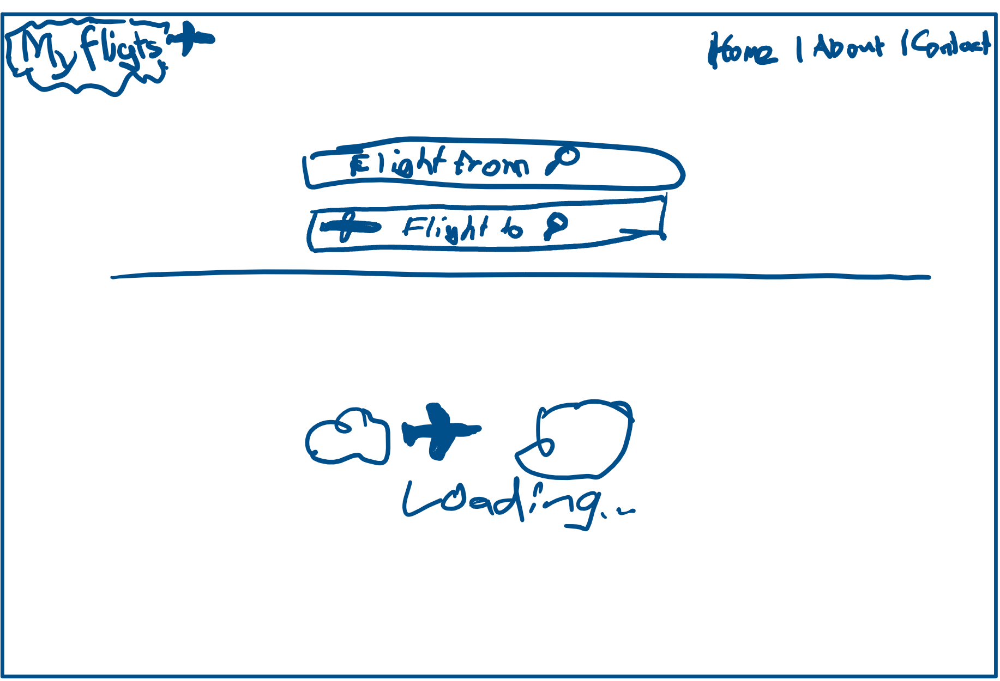
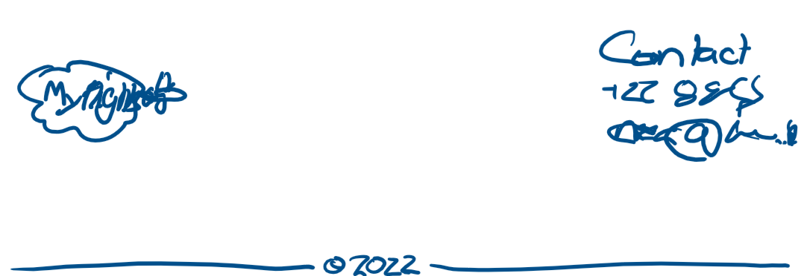
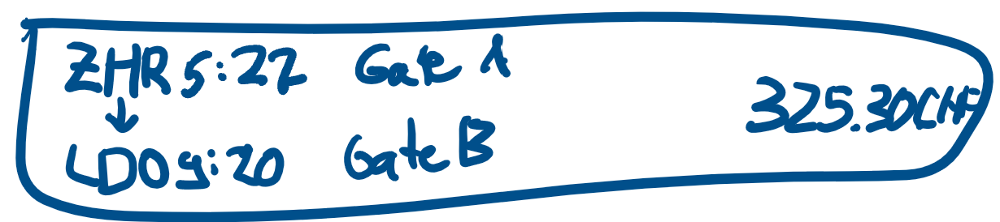

<h1>M431-MyFlights</h1>

Project for school module M431

-----------------------
 
 

# I - Informieren

Unsere Idee ist es, eine Seite mit springboot und Thymleaf zu aufzubauen. Auf dieser Seite werden dann die Flüge zwischen zwei ausgewählten Flughafen angezeigt. Wenn dann ein Flug ausgewählt wurde, wird die Anzahl Tickets die übrig sind angezeigt, und wie viel ein Ticket kostet.

# P - Planung

Bei der Planung überlegten wir uns ein Design und ein Konzept wie wir die Seite aufbauen möchten. Ausserdem machten wir uns ein wenig Gedanken, wie wir das ganze mit Springboot umsetzen möchten.

Beim Design überlegten wir uns folgendes. 
Die Home Seite sollte eine Navbar haben (wie eigentlich jede Webseite) und eine Suchfunktion. Auch überlegten wir uns eine loading-Animation.

Home Seite Planung Styling: 

Planung Styling Footer: 

Planung Styling Fluginformation: 

## Zeitplanung

| Datum      | # Lektion | Wer?         | Was?                     |
| ---------- | --------- | ------------ | ------------------------ |
| 09.06.2022 | 4         | Jonas        | Navbar erstellen         |
| 09.06.2022 | 4         | Noah         | Footer erstellen         |
| 16.06.2022 | 1         | Jonas        | API einbinden            |
| 16.06.2022 | 1         | Noah         | Sidebar implementieren   |
| 16.06.2022 | 2         | Jonas & Noah | Flugkarte erstellen      |
| 16.06.2022 | 3         | Jonas        | Api Data darstellen      |
| 16.06.2022 | 4         | -            | Pufferzeit               |
| 23.06.2022 | 1         | Jonas & Noah | Dokumentation schreiben  |
| 23.06.2022 | 2         | Noah         | Design verbessern        |
| 23.06.2022 | 2         | Jonas        | FAQ Page                 |
| 23.06.2022 | 3         | -            | Pufferzeit               |
| 23.06.2022 | 4         | -            | Pufferzeit               |
| 30.06.2022 | 1         | Jonas & Noah | Präsentation vorbereiten |
| 30.06.2022 | 2         | Jonas & Noah | Präsentation vorbereiten |

# E - Entscheiden

Wir haben uns noch ein wenig mehr über unsere Idee recherchiert, und sind zum Schluss gekommen, dass es ein gutes und umsetzbares Projekt ist.

Auch viel uns noch der Entscheid, welches Framework wir benutzen sollten. Da Noah ziemlich gut ist in View.js entschieden wir uns beide, dass wir dieses verwenden werden. So lernt Jonas auch noch was gutes dazu.

# R - Realisierung

## 16.06.2022

### Jonas
| Datum      | Was weiss/kann ich nun mehr als vor den Lektionen? | Was habe ich gemacht, ganz konkret? | Wie bin ich vorgegangen?                                              | Wo hatte ich Schwierigkeiten? | Wer kann mir helfen um weiterzukommen? |
| ---------- | -------------------------------------------------- | ----------------------------------- | --------------------------------------------------------------------- | ----------------------------- | -------------------------------------- |
| 16.06.2022 | Grundlagen von Vue.js                              | - 404 Error Page hinzugefügt        | - Design von Home page übernommen   - Path zu router hinzugefügt | - Stylen der Website          | Noah                                   |

### Noah

Ich habe in den heutigen Lektionen eigentlich ziemlich viel styling gemacht. Ich habe die Startseite designt und viele kleine Fehler von Jonas angepasst. Ich hielf ihm heute ziemlich aus und zeigte ihm React. Er hat mir bereits gesagt, dass es wirklich nicht kompliziert und schwierig aussieht. Ich hoffe er kommt gut damit zurecht.

Ich habe leider nichts gelernt, es war alles eher eine Fleissarbeit. Das gute aber ist, dass ich gut damit zurecht komme und sehr geübt bin mit CSS und HTML. Wenn ich aber Schwierigkeiten hätte, wäre das Internet wahrscheinlich die einzige Lösung.

## 23.06.2022

### Noah

Mir erging es heute eigentlich wieder wie letzte Woche. Ich liess Jonas an der API arbeiten währendessen ich mich dem Styling widmete. Ich erstellte mit Photoshop 2 Banner für die Startseite und fing schonmal mit der FAQ-Seite an. Wenn ich es mit dem Zeitplan vergleiche, sind wir ziemlich hinterrein und müssen wahrscheinlich noch ein wenig mehr in der Freizeit arbeiten.

Die Seite sieht bis jetzt schon wirklich sehr gut aus, es fehlt eigentlich nur noch die API implementation. Ich lernte heute wie man ein schönes Zahlen eingabe Feld macht und ich weiss auch bereits, wie ich dies noch ein wenig mehr optimieren kann.
